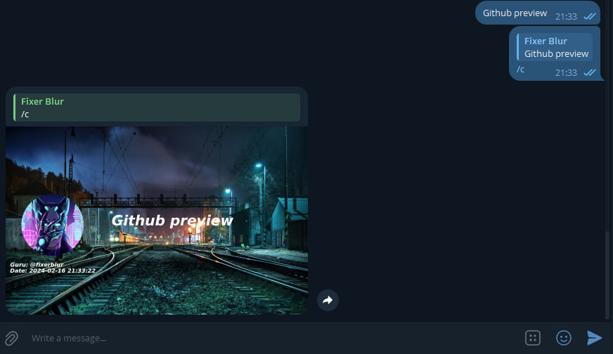

<div align="center">
  <a href="https://github.com/FixerBlur/PenPen-QuoteBot">
    
  </a>

<h3 align="center">🐧PenPen</h3>

  <p align="center">
    Your favorite quote in photo
    <br />
  </p>
</div>

## 🔥 About The Project

</img>

This bot can turn the text of your interlocutor in a chat or group into a quote on a photo. 
You need to press "reply" to the desired message and send it with the text "/c" and then the bot will send a photo with the text of the message you have chosen 

<hr>

## ⚙️ Initial Setup

1. Install the necessary libraries, modules, and other project dependencies

Automatically install through requirments.txt file
 ```sh
pip install -r requirements.txt
 ```
Or if it's more convenient for you, you can install everything manually:
 ```sh
pip install aiogram==2.25.1
pip install aiofiles==23.2.1
pip install aiosqlite==0.19.0
pip install python-dotenv==1.0.0
pip install pillow==10.2.0
```
2. Create an .env file in the main project folder and place your bot's token in it in this form: 
```sh
BOT_TOKEN='your token her'
```
3. In the notify_admins.py file, insert the telegram id of your account into the admins variable so that you receive notifications about the bot startup and shutdown
 ```sh
admins = [your telegram id here]
 ```
4. Finish. The bot is launched through the bot.py file

## ⚡️ Usage

Add a bot as a member to your group or chat
After that, select the message from which you want to make a quote, click reply to it and send the /c command

Example: `/c`

The bot will send a message with a photo and text of the message you have chosen and its author

> [!NOTE]
> The bot does not need to be granted administrator rights, it just needs to have access to sending messages and media

If you don't succeed in granting rights to a bot, the easiest option is to give it an administrator

> [!NOTE]
> You can grant rights by right-clicking on the user (bot), then restrict the user and there should be checkboxes related to sending messages and media

<hr/>

## 📞 Contact with me

<br>
<a target="_blank" href="https://t.me/fixerblur"></img></a>
<a target="_blank" href="mailto:fixerblur@outlook.com"></img></a>
<a target="_blank" href="https://twitter.com/fixerblurGG"></img></a>

<br>

## 🍩 Support
<div align="center">
  <a href="https://www.buymeacoffee.com/fixerblur">
    
  </a>
</div>
