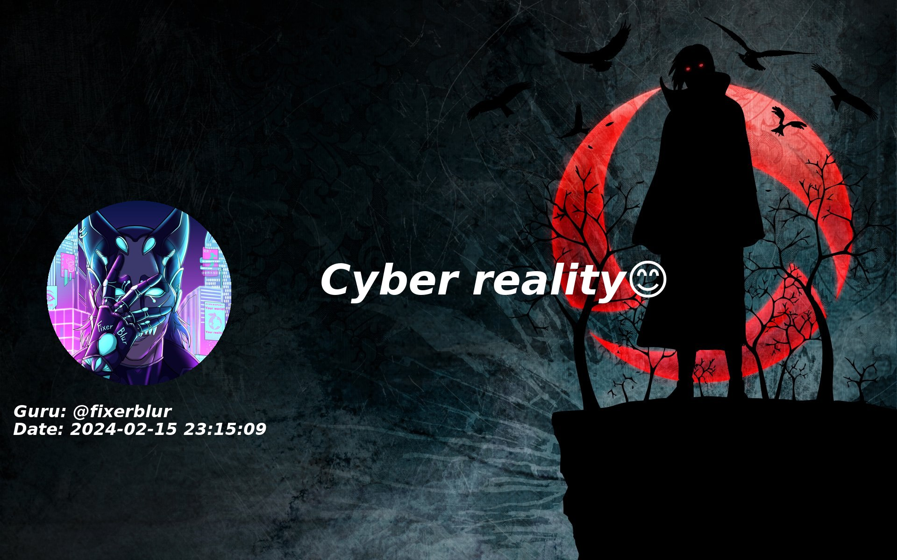

<div align="center">
  <a href="https://github.com/FixerBlur/PenPen-QuoteBot">
    
  </a>

<h3 align="center">😺 PenPen</h3>

  <p align="center">
    Your favorite quote in photo😊
    <br />
  </p>
</div>

## ℹ️ About The Project

</img>

This bot can turn the text of your interlocutor in a chat or group into a quote on a photo. 
You need to press "reply" to the desired message and send it with the text "/c" and then the bot will send a photo with the text of the message you have chosen 

<hr>

## 🧧 Getting Started

1. Install the libraries you need

 ```sh
pip install aiogram==2.25.1
```
